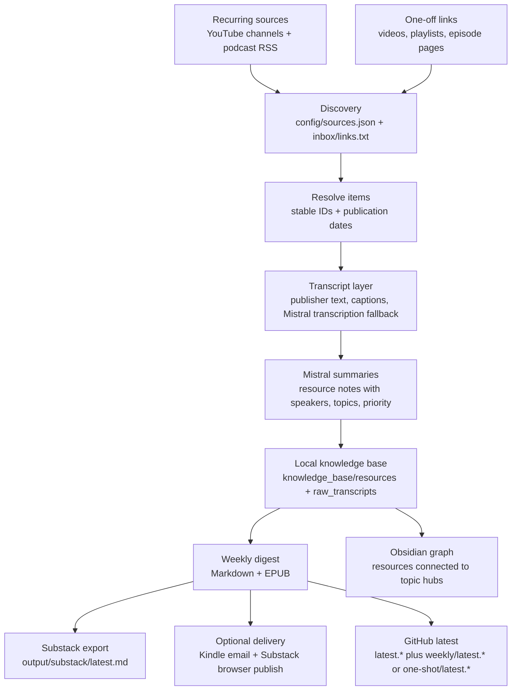

# AI Weekly Reads

AI Weekly Reads turns AI videos and podcasts into a weekly reading edition for Substack, Kindle, GitHub, and a local Obsidian knowledge base.

## Read It

- **Substack:** [AI Weekly Reads](https://aiweeklyreads.substack.com/)
- **Latest GitHub edition:** [`latest.md`](latest.md)
- **Latest EPUB:** [`latest.epub`](latest.epub)
- **Latest weekly GitHub edition:** [`weekly/latest.md`](weekly/latest.md)
- **Latest weekly EPUB:** [`weekly/latest.epub`](weekly/latest.epub)
- **Latest one-shot GitHub edition:** [`one-shot/latest.md`](one-shot/latest.md)
- **Latest one-shot EPUB:** [`one-shot/latest.epub`](one-shot/latest.epub)
- **Kindle:** public EPUBs at [`latest.epub`](latest.epub), [`weekly/latest.epub`](weekly/latest.epub), and [`one-shot/latest.epub`](one-shot/latest.epub) when available, with optional private send-to-Kindle delivery

The public GitHub edition is intentionally rolling:

- Every public build refreshes the top-level `latest.md` and `latest.epub`.
- Weekly runs replace `weekly/latest.md` and `weekly/latest.epub`.
- One-shot playlist runs replace `one-shot/latest.md` and `one-shot/latest.epub`.

The key design choice is:

- **Generation:** build Markdown/EPUB/public files from source material
- **Distribution:** optionally send/publish those files to your own channels

The repository defaults to generation first. Personal delivery is explicit.

## What Gets Covered

Recurring sources live in [`config/sources.json`](config/sources.json). The weekly run looks back through each source, filters to the configured publication window, skips already-processed items, and summarizes new items.

Sources are grouped by editorial type, then fetched through the most reliable upstream for that source. Podcast RSS is preferred when it exists because it carries cleaner episode dates, audio URLs, and show metadata. Some podcast-style shows are still sourced from YouTube because the YouTube channel or playlist is the better upstream for that show.

### YouTube Channels

- [aiDotEngineer](https://www.youtube.com/@aiDotEngineer)
- [Cursor](https://www.youtube.com/@cursor_ai/videos)
- [Stripe](https://www.youtube.com/@stripe/videos)
- [Vanishing Gradients livestreams](https://www.youtube.com/@vanishinggradients/streams)
- [Claude livestreams](https://www.youtube.com/@claude/streams)
- [Stanford Online](https://www.youtube.com/@stanfordonline/)

### Podcasts And Podcast-Style Sources

- [Lenny's Podcast](https://www.lennysnewsletter.com/podcast)
- [Lex Fridman Podcast](https://lexfridman.com/podcast/)
- [Latent Space](https://www.youtube.com/@LatentSpacePod)
- [Training Data](https://www.youtube.com/playlist?list=PLOhHNjZItNnMm5tdW61JpnyxeYH5NDDx8)
- [No Priors](https://www.youtube.com/@NoPriorsPodcast)
- [Unsupervised Learning](https://www.youtube.com/@RedpointAI)
- [The MAD Podcast with Matt Turck](https://www.youtube.com/@DataDrivenNYC/videos)
- [AI & I by Every](https://www.youtube.com/playlist?list=PLuMcoKK9mKgHtW_o9h5sGO2vXrffKHwJL)

One-off links can also be added to `inbox/links.txt`, and one-shot YouTube playlists can be processed with `scripts/build_playlist_digest.py`.

## How It Works



The project is local-first. Raw transcripts, resource notes, generated EPUBs, private settings, browser sessions, and delivery ledgers are ignored by Git. The repository stores the workflow, prompts, source registry, and the current rolling public editions.

## How YouTube And Podcasts Are Processed

After discovery, every item goes through the same shared pipeline: stable ID, publication-date filtering, transcript lookup, summary generation, resource-note write, weekly digest build, and optional distribution. The only real difference is how discovery and transcript collection work at the front of the pipeline.

### YouTube

1. The weekly run collects recent video URLs from configured channels or playlists with `yt-dlp --flat-playlist`.
2. Each URL is resolved into a media item with `yt-dlp` metadata such as title, channel name, description, and upload date.
3. If a raw transcript is already cached locally, it is reused.
4. Otherwise the workflow tries YouTube captions first.
5. If captions are missing and Mistral transcription is enabled, it downloads the audio and transcribes that file.
6. The transcript is stored locally, summarized, and written into the weekly outputs.

### Podcasts

1. The weekly run fetches configured RSS feeds and turns each recent entry into a media item using the feed GUID, link, or enclosure URL as the stable key.
2. The feed entry supplies the episode title, published date, description, and audio enclosure when available.
3. If a raw transcript is already cached locally, it is reused.
4. Otherwise the workflow looks for a transcript embedded in the publisher description first.
5. If no publisher transcript is present and Mistral transcription is enabled, it tries the remote audio URL directly, then falls back to downloading the media file and transcribing that file.
6. The transcript is stored locally, summarized, and written into the weekly outputs.

The summary and output stage is identical after that point. Both source types end up as local resource notes in `knowledge_base/resources/`, raw transcript notes in `knowledge_base/raw_transcripts/`, a top-level public Markdown/EPUB pair in `latest.md` and `latest.epub`, a category-specific public Markdown digest in `weekly/latest.md` for weekly runs or `one-shot/latest.md` for playlist runs, a matching category-specific EPUB when available, and a Substack-ready export in `output/substack/latest.md`.

## Outputs

- `latest.md`: most recently refreshed public edition tracked in Git, regardless of weekly vs one-shot
- `latest.epub`: EPUB companion for the most recently refreshed public edition when available
- `weekly/latest.md`: current summaries-only weekly public edition tracked in Git
- `weekly/latest.epub`: current weekly public Kindle-friendly EPUB tracked in Git
- `one-shot/latest.md`: current public one-shot playlist edition tracked in Git
- `one-shot/latest.epub`: current public one-shot playlist EPUB tracked in Git when available
- `output/kindle-digest-YYYY-MM-DD.md`: local weekly Markdown book
- `output/kindle-digest-YYYY-MM-DD.epub`: Kindle-friendly EPUB when `pandoc` is installed
- `output/substack/latest.md`: current Substack-ready post
- `knowledge_base/resources/`: local clean reading notes for Obsidian
- `knowledge_base/raw_transcripts/`: local raw transcript/text archive

## Weekly Run

The default weekly command builds artifacts only:

```bash
.venv/bin/python scripts/build_weekly_digest.py
```

It does all of the following:

1. Fetches recurring sources and inbox links.
2. Filters recurring sources to the last `publication_window_days` days.
3. Reuses already-summarized resources.
4. Transcribes and summarizes new items when needed.
5. Builds the weekly digest.
6. Writes `latest.md` and `weekly/latest.md`.
7. Writes `latest.epub` and `weekly/latest.epub` when an EPUB is available.
8. Writes `output/substack/latest.md`.

It does **not** email Kindle or publish to Substack by default.

### Build-Only Commands

```bash
.venv/bin/python scripts/build_weekly_digest.py
.venv/bin/python scripts/build_latest_digest.py
.venv/bin/python scripts/build_substack_post.py --force
```

### Optional Distribution

Use explicit follow-up commands when you want personal delivery or browser-based publishing:

```bash
.venv/bin/python scripts/send_latest_to_kindle.py
.venv/bin/python scripts/send_latest_to_kindle.py --force
PLAYWRIGHT_BROWSERS_PATH=.venv-substack/ms-playwright .venv-substack/bin/python scripts/create_substack_draft.py
PLAYWRIGHT_BROWSERS_PATH=.venv-substack/ms-playwright .venv-substack/bin/python scripts/create_substack_draft.py --publish
```

If you want one command that builds and then sends to Kindle, use:

```bash
.venv/bin/python scripts/build_weekly_digest.py --send-kindle
.venv/bin/python scripts/build_latest_digest.py --send-kindle
```

Process a one-shot YouTube playlist:

```bash
.venv/bin/python scripts/build_playlist_digest.py "https://www.youtube.com/playlist?list=PLAYLIST_ID" --send-kindle --substack
```

That command also refreshes the rolling public one-shot artifacts at `one-shot/latest.md` and `one-shot/latest.epub`, and it updates the top-level `latest.md` and `latest.epub` pointers to that one-shot edition.

Publish the latest Substack post with the saved browser profile:

```bash
PLAYWRIGHT_BROWSERS_PATH=.venv-substack/ms-playwright .venv-substack/bin/python scripts/create_substack_draft.py --publish
```

## Setup

Create the primary virtual environment and install dependencies:

```bash
python3 -m venv .venv
.venv/bin/pip install -r requirements.txt
```

EPUB generation additionally requires the external `pandoc` binary (for example `brew install pandoc` on macOS). Without it, builds still produce Markdown output.

## Configuration

Start from the example files:

```bash
cp config/settings.example.json config/settings.json
cp .env.example .env
cp inbox/links.example.txt inbox/links.txt
```

Local-only files:

- `config/settings.json`: personal settings
- `.env`: API keys and delivery settings
- `inbox/links.txt`: one-off weekly links
- `config/private/`: Gmail OAuth tokens and Substack browser profile

Important settings in `config/settings.json`:

- `publication_window_days`: how many days count as the current weekly window
- `weekly_resource_limit`: maximum resources in the weekly book
- `max_items_per_run`: optional cost/safety cap; `0` means no cap
- `kindle_output_format`: `epub` or `markdown`

Per-source settings in `config/sources.json`:

- `lookback_count`: how many recent items to inspect for that source before publication-date filtering

## Services

### Mistral

`MISTRAL_API_KEY` enables AI summaries and transcription fallback.

```bash
MISTRAL_API_KEY=your-api-key
```

Default models are configured in `config/settings.json`:

- summaries: `mistral-small-latest`
- transcription: configurable in `config/settings.json`

### Kindle

Kindle delivery is local and private. Keep these in `.env`:

```bash
KINDLE_ENABLED=true
KINDLE_DELIVERY_METHOD=gmail_api
KINDLE_EMAIL=yourname_123@kindle.com
KINDLE_SENDER_EMAIL=your.gmail.address@gmail.com
GMAIL_CREDENTIALS_PATH=config/private/gmail_credentials.json
GMAIL_TOKEN_PATH=config/private/gmail_token.json
```

Set up Gmail OAuth once:

```bash
.venv/bin/python scripts/setup_gmail_oauth.py
```

Successful sends are recorded in `output/_metadata/kindle_delivery.json` so the same file is not resent accidentally.

### Substack

Substack support has two separate steps:

1. Generate a Substack-ready Markdown post at `output/substack/latest.md`
2. Optionally publish it through a dedicated Playwright browser profile

Local setup:

```bash
python3 -m venv .venv-substack
.venv-substack/bin/pip install -r requirements-substack.txt
PLAYWRIGHT_BROWSERS_PATH=.venv-substack/ms-playwright .venv-substack/bin/playwright install chromium
PLAYWRIGHT_BROWSERS_PATH=.venv-substack/ms-playwright .venv-substack/bin/python scripts/create_substack_draft.py --setup
```

The browser session is stored under `config/private/substack/browser` and ignored by Git. You should only need to log in again if Substack expires or challenges the session.

## Obsidian Knowledge Base

Open `knowledge_base/` as an Obsidian vault.

The vault contains:

- resource notes with summaries, Q&A, takeaways, speaker metadata, and topic tags
- raw transcript notes stored separately
- generated source, people, topic, and index notes
- weekly books under `knowledge_base/weekly_books/`

The generated graph preset hides storage details such as raw transcripts, sources, people, weekly compilations, templates, indexes, and repository files. The goal is for the graph to show knowledge relationships, mainly resources connected to topic hubs.

## Project Layout

- `config/sources.json`: recurring source registry
- `config/settings.example.json`: shareable settings template
- `inbox/links.example.txt`: shareable inbox template
- `scripts/pipeline.py`: shared update/build/send workflow
- `scripts/build_weekly_digest.py`: weekly runner
- `scripts/build_playlist_digest.py`: one-shot YouTube playlist runner
- `scripts/create_substack_draft.py`: Substack browser draft/publish automation
- `scripts/send_to_kindle.py`: Kindle delivery
- `scripts/resources.py`: resource note writer
- `scripts/digest.py`: weekly book builder
- `prompts/`: Mistral summary prompts
- `assets/kindle.css`: Kindle EPUB stylesheet

## Maintenance

Run local checks:

```bash
.venv/bin/python -m py_compile scripts/*.py scripts/transcription/*.py
.venv/bin/python scripts/check_repo_health.py
.venv/bin/python scripts/audit_knowledge_base.py
```

Normalize Obsidian metadata after hand edits or migrations:

```bash
.venv/bin/python scripts/normalize_knowledge_base.py
```

GitHub Actions only runs lightweight repository health checks. It does not fetch media, call Mistral, transcribe audio, publish Substack posts, or send Kindle email.
