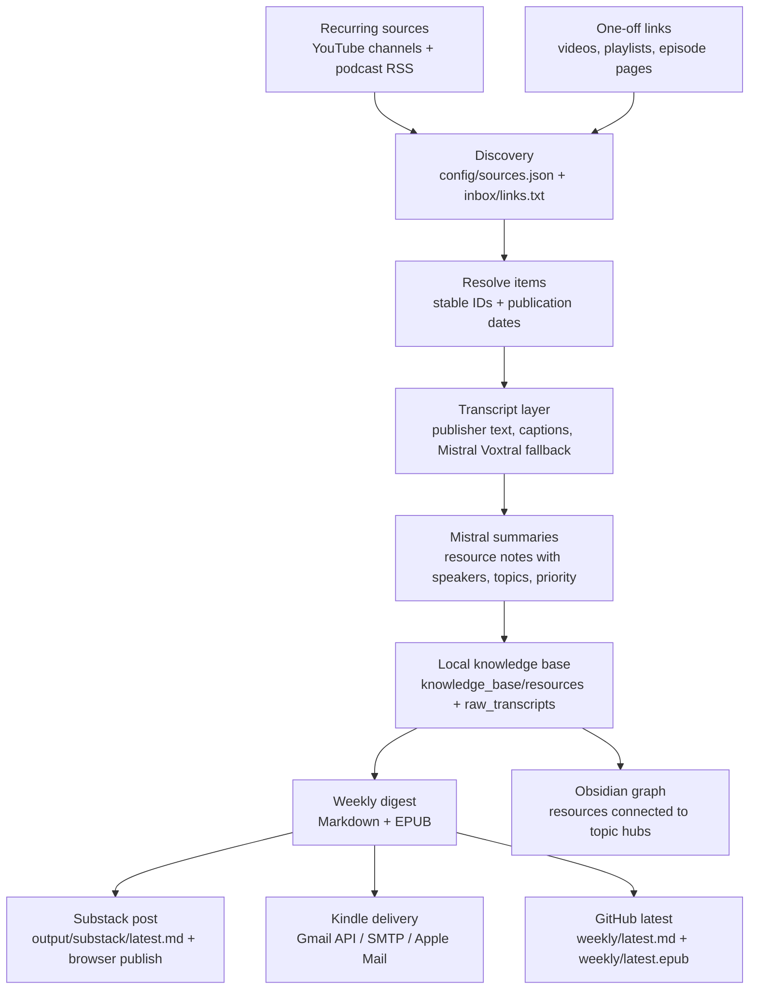

# AI Weekly Reads

AI Weekly Reads turns AI videos and podcasts into a weekly reading edition for Substack, Kindle, GitHub, and a local Obsidian knowledge base.

## Read It

- **Substack:** [AI Weekly Reads](https://aiweeklyreads.substack.com/)
- **Latest GitHub edition:** [`weekly/latest.md`](weekly/latest.md)
- **Latest EPUB:** [`weekly/latest.epub`](weekly/latest.epub)
- **Kindle:** generated locally as EPUB/Markdown under `output/` and sent by the local delivery script

The public GitHub edition is intentionally a rolling pair of files. Each weekly run replaces `weekly/latest.md` and `weekly/latest.epub`.

## What Gets Covered

Recurring sources live in [`config/sources.json`](config/sources.json). The weekly run looks back through each source, filters to the configured publication window, skips already-processed items, and summarizes new items.

Sources are grouped by how the system fetches them. Podcast RSS is preferred for real podcasts because it carries cleaner episode dates, audio URLs, and show metadata. YouTube stays best for video channels, livestream-only tabs, and one-off playlists.

### YouTube Channels

- [aiDotEngineer](https://www.youtube.com/@aiDotEngineer)
- [Cursor](https://www.youtube.com/@cursor_ai/videos)
- [Stripe](https://www.youtube.com/@stripe/videos)
- [Vanishing Gradients livestreams](https://www.youtube.com/@vanishinggradients/streams)
- [Claude livestreams](https://www.youtube.com/@claude/streams)

### Podcast RSS Feeds

- [Lenny's Podcast](https://www.lennysnewsletter.com/podcast)
- [Lex Fridman Podcast](https://lexfridman.com/podcast/)
- [Latent Space](https://www.youtube.com/@LatentSpacePod)
- [Training Data](https://www.youtube.com/playlist?list=PLOhHNjZItNnMm5tdW61JpnyxeYH5NDDx8)
- [No Priors](https://www.youtube.com/@NoPriorsPodcast)
- [Unsupervised Learning](https://www.youtube.com/@RedpointAI)
- [The MAD Podcast with Matt Turck](https://www.youtube.com/@DataDrivenNYC/videos)
- [AI & I by Every](https://www.youtube.com/playlist?list=PLuMcoKK9mKgHtW_o9h5sGO2vXrffKHwJL)

One-off links can also be added to `inbox/links.txt`, and one-shot YouTube playlists can be processed with `scripts/build_playlist_digest.py`.

## How It Works



The project is local-first. Raw transcripts, resource notes, generated EPUBs, private settings, browser sessions, and delivery ledgers are ignored by Git. The repository stores the workflow, prompts, source registry, and the single current public edition.

## Outputs

- `weekly/latest.md`: current summaries-only public edition tracked in Git
- `weekly/latest.epub`: current public Kindle-friendly EPUB tracked in Git
- `output/kindle-digest-YYYY-MM-DD.md`: local weekly Markdown book
- `output/kindle-digest-YYYY-MM-DD.epub`: Kindle-friendly EPUB when `pandoc` is installed
- `output/substack/latest.md`: current Substack-ready post
- `knowledge_base/resources/`: local clean reading notes for Obsidian
- `knowledge_base/raw_transcripts/`: local raw transcript/text archive

## Weekly Run

This machine already has a project virtualenv, so the normal weekly command is:

```bash
.venv/bin/python scripts/build_weekly_digest.py
```

That command:

1. Fetches recurring sources and inbox links.
2. Filters recurring sources to the last `publication_window_days` days.
3. Reuses already-summarized resources.
4. Transcribes and summarizes new items when needed.
5. Builds the weekly digest.
6. Exports the Substack post.
7. Refreshes `weekly/latest.epub` when an EPUB is available.
8. Sends the Kindle file if Kindle delivery is enabled.

Useful manual commands:

```bash
.venv/bin/python scripts/update_knowledge_base.py
.venv/bin/python scripts/build_latest_digest.py
.venv/bin/python scripts/build_latest_digest.py --send
.venv/bin/python scripts/send_latest_to_kindle.py
.venv/bin/python scripts/build_substack_post.py --force
```

Process a one-shot YouTube playlist:

```bash
.venv/bin/python scripts/build_playlist_digest.py "https://www.youtube.com/playlist?list=PLAYLIST_ID" --send-kindle --substack
```

Publish the latest Substack post with the saved browser profile:

```bash
PLAYWRIGHT_BROWSERS_PATH=.venv-substack/ms-playwright .venv-substack/bin/python scripts/create_substack_draft.py --publish
```

## Configuration

Start from the example files:

```bash
cp config/settings.example.json config/settings.json
cp .env.example .env
cp inbox/links.example.txt inbox/links.txt
```

Local-only files:

- `config/settings.json`: personal settings
- `.env`: API keys and delivery settings
- `inbox/links.txt`: one-off weekly links
- `config/private/`: Gmail OAuth tokens and Substack browser profile

Important settings:

- `publication_window_days`: how many days count as the current weekly window
- `lookback_count`: how many recent items to inspect per source
- `weekly_resource_limit`: maximum resources in the weekly book
- `max_items_per_run`: optional cost/safety cap; `0` means no cap
- `kindle_output_format`: `epub` or `markdown`

## Services

### Mistral

`MISTRAL_API_KEY` enables AI summaries and Voxtral transcription fallback.

```bash
MISTRAL_API_KEY=your-api-key
```

Default models are configured in `config/settings.json`:

- summaries: `mistral-small-latest`
- transcription: `voxtral-mini-latest`

### Kindle

Kindle delivery is local and private. Keep these in `.env`:

```bash
KINDLE_ENABLED=true
KINDLE_DELIVERY_METHOD=gmail_api
KINDLE_EMAIL=yourname_123@kindle.com
KINDLE_SENDER_EMAIL=your.gmail.address@gmail.com
GMAIL_CREDENTIALS_PATH=config/private/gmail_credentials.json
GMAIL_TOKEN_PATH=config/private/gmail_token.json
```

Set up Gmail OAuth once:

```bash
.venv/bin/python scripts/setup_gmail_oauth.py
```

Successful sends are recorded in `output/_metadata/kindle_delivery.json` so the same file is not resent accidentally.

### Substack

Substack output is generated as Markdown first, then optionally published through a dedicated Playwright browser profile.

Local setup:

```bash
python3 -m venv .venv-substack
.venv-substack/bin/pip install -r requirements-substack.txt
PLAYWRIGHT_BROWSERS_PATH=.venv-substack/ms-playwright .venv-substack/bin/playwright install chromium
PLAYWRIGHT_BROWSERS_PATH=.venv-substack/ms-playwright .venv-substack/bin/python scripts/create_substack_draft.py --setup
```

The browser session is stored under `config/private/substack/browser` and ignored by Git. You should only need to log in again if Substack expires or challenges the session.

## Obsidian Knowledge Base

Open `knowledge_base/` as an Obsidian vault.

The vault contains:

- resource notes with summaries, Q&A, takeaways, speaker metadata, and topic tags
- raw transcript notes stored separately
- generated source, people, topic, and index notes
- weekly books under `knowledge_base/weekly_books/`

The generated graph preset hides storage details such as raw transcripts, sources, people, weekly compilations, templates, indexes, and repository files. The goal is for the graph to show knowledge relationships, mainly resources connected to topic hubs.

## Project Layout

- `config/sources.json`: recurring source registry
- `config/settings.example.json`: shareable settings template
- `inbox/links.example.txt`: shareable inbox template
- `scripts/pipeline.py`: shared update/build/send workflow
- `scripts/build_weekly_digest.py`: weekly runner
- `scripts/build_playlist_digest.py`: one-shot YouTube playlist runner
- `scripts/create_substack_draft.py`: Substack browser draft/publish automation
- `scripts/send_to_kindle.py`: Kindle delivery
- `scripts/resources.py`: resource note writer
- `scripts/digest.py`: weekly book builder
- `prompts/`: Mistral summary prompts
- `assets/kindle.css`: Kindle EPUB stylesheet

## Maintenance

Run local checks:

```bash
.venv/bin/python -m py_compile scripts/*.py scripts/transcription/*.py
.venv/bin/python scripts/check_repo_health.py
.venv/bin/python scripts/audit_knowledge_base.py
```

Normalize Obsidian metadata after hand edits or migrations:

```bash
.venv/bin/python scripts/normalize_knowledge_base.py
```

GitHub Actions only runs lightweight repository health checks. It does not fetch media, call Mistral, transcribe audio, publish Substack posts, or send Kindle email.
